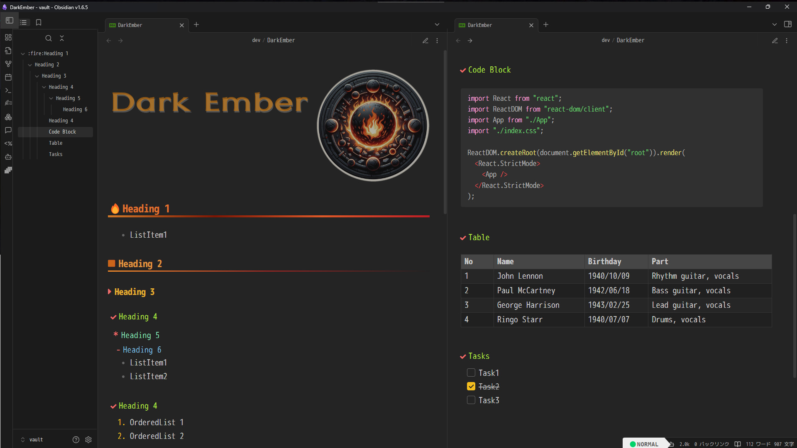

# Obsidian-theme-DarkEmber

[English](README.md) | [日本語](README.ja.md)

## Overview

- Custom theme for Obsidian.

## Features

- Dark mode / Light mode.
- Toggle on/off heading decorations.
- Four color presets.
- Compatible with [Style Settings Plugin](https://github.com/mgmeyers/obsidian-style-settings).
- More configuration options planned for the future.

## Update History

### v 1.1.1 2024/07/18 (Thu)

- Adjusted calendar margins
- Minor modifications to Style Settings configuration

### v 1.1.0 2024/07/14 (Sun)

- Removed dependency on external fonts and improved to SVG-based icons.
- Added top and bottom margins to H5 and H6 headings for better spacing.

### v 1.0.3 2024/07/11 (Thu)

- Initial release
